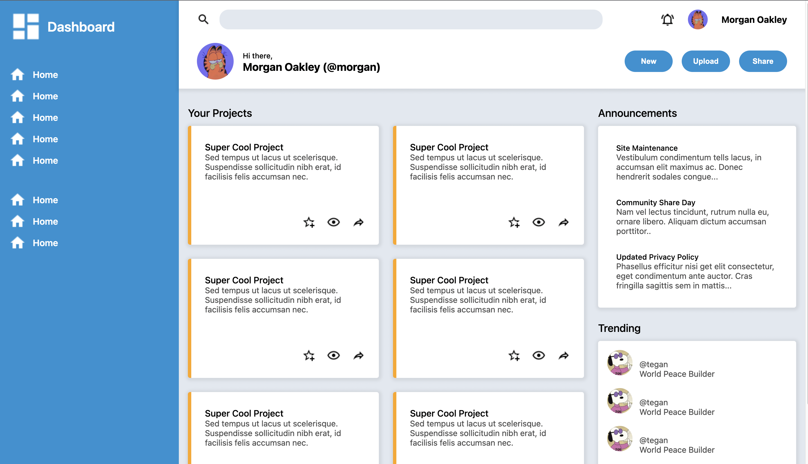

# Odin Project - Admin Dashboard solution

This is a solution to the [Admin Dashboard project on Odin Project](https://www.theodinproject.com/lessons/node-path-intermediate-html-and-css-admin-dashboard). Odin Project is a web development pathway course.

## Table of contents

- [Odin Project - Admin Dashboard solution](#odin-project---admin-dashboard-solution)
  - [Table of contents](#table-of-contents)
  - [Overview](#overview)
    - [Screenshot](#screenshot)
    - [Links](#links)
  - [My Process](#my-process)
    - [What I Learned](#what-i-learned)
    - [Continued Development](#continued-development)
  - [Author](#author)
  - [Acknowledgments](#acknowledgments)

## Overview

### Screenshot

### Links

- [Live Site URL](https://lrvaka.github.io/odin-admin-dashboard/)

## My Process
Completion of the Odin Project Admin Dashboard project in the Intermediate HTML and CSS section. This is the final project of this leg of the course. We had to practice our skills in CSS Grid. This project was a recreation of the design provided to us in the instructions - the entire project was made entirely with CSS Grid.

### What I Learned
I learned about the different nuances working in 1D and 2D alignments with CSS Grid. It's very capable of doing the same things as Flexbox with maybe just a few extra lines of code. It wasn't too hard imitating how content controls the sizing in Flexbox with CSS Grid. The usage of max/min-content and the auto sizing were a big help in achieving those same effects. That was probably the biggest hurdle working with CSS Grid - letting the content control the layout in certain parts.  Although it's very different then Flexbox, it's still all very intuitive working with Grid. Grid Gang💸.

### Continued Development
I look forward to using the new skills I've learned with CSS Grid and combining them with Flexbox. The usage of either will be dependent on the situation. 

## Author

- Website - [Luke Vakasisikakala](https://lrvaka.com/)

## Acknowledgments

Mum.
